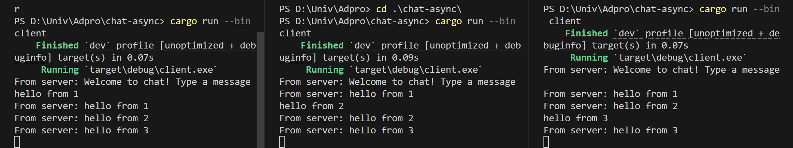

# Experiment 2.1: Original code, and how it run
Setelah menjalankan server, client dapat mengirim pesan. Salah satu hal unik adalah setiap suatu client mengetikkan pesan, pesan tersebut dikirimkan ke server yang kemudian disebarkan ke semua client yang terhubung. Sehingga semua client dapat melihat pesan-pesan yang dikirim oleh client lainnya secara real-time.